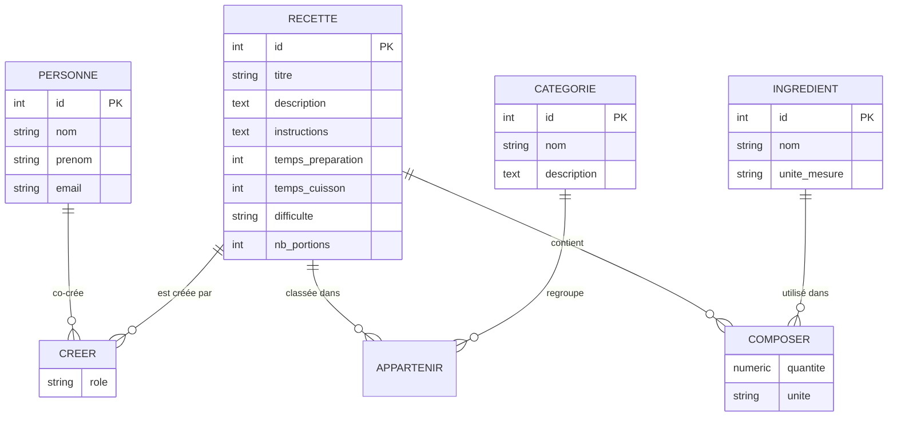

# Guide pédagogique — Gestion de recettes (Angular v21 + PHP 8.3 + PostgreSQL)

Ce guide accompagne le dépôt et peut être suivi étape par étape en cours. Il part du modèle
conceptuel de données (MCD) jusqu'à une application conteneurisée (Docker) avec une API REST
en PHP 8.3 et une maquette front-end Angular v21.

Niveau visé : apprenants ayant déjà une base en SQL, POO et Angular — on pousse ici vers une
approche "DevOps" (conteneurisation par service, sans framework PHP, avec des choix explicites
et justifiés à chaque étape).

---

## 0. Vue d'ensemble de l'architecture

```
┌─────────────┐      HTTP/JSON      ┌──────────────┐      SQL (PDO)      ┌────────────┐
│  Angular v21 │ ───────────────▶ │  API PHP 8.3  │ ───────────────▶ │ PostgreSQL │
│  (web:4200)  │ ◀─────────────── │  (api:8080)  │ ◀─────────────── │ (db:5432)  │
└─────────────┘                    └──────────────┘                    └────────────┘
```

Chaque couche vit dans son propre conteneur Docker, orchestré par `docker-compose.yml` :
c'est l'entrée en matière la plus réaliste vers une approche microservices sans complexité
inutile pour un projet pédagogique (voir §4.4 pour la discussion sur "aller plus loin vers du
microservice pur").

---

## 1. Du MCD au schéma physique PostgreSQL

### 1.1 Rappel express

- **Entité** : un objet métier qu'on veut mémoriser (`Recette`, `Personne`, `Catégorie`).
- **Association** : un lien entre entités, avec des cardinalités (`0,1`, `1,1`, `0,n`, `1,n`).
- **Règle d'or du passage MCD → schéma physique (MPD)** :
  - une association **1,n** se traduit par une **clé étrangère** dans l'entité côté "n" ;
  - une association **n,n** se traduit par une **table d'association** (table pivot) portant
    les deux clés étrangères en clé primaire composite.

### 1.2 Le MCD du projet



Points à faire remarquer aux apprenants :

- `CREER` (Personne ↔ Recette) est une association **n,n** : plusieurs personnes peuvent
  co-créer une recette, une personne crée plusieurs recettes. Elle porte un attribut
  supplémentaire (`role` : auteur principal, contributeur…).
- `APPARTENIR` (Recette ↔ Catégorie) est une association **n,n** simple (pas d'attribut porté).
- `COMPOSER` (Recette ↔ Ingrédient) est une association **n,n porteuse d'attributs**
  (`quantite`, `unite`) : un très bon exemple pour montrer qu'une table pivot peut avoir des
  colonnes propres, au-delà des deux clés étrangères.

### 1.3 Passage au schéma physique

Chaque entité devient une table, chaque association n,n devient une table pivot avec une clé
primaire composite. Voir le fichier complet : [`db/schema.sql`](../db/schema.sql).

Extrait commenté (l'association `CREER`) :

```sql
CREATE TABLE recette_personne (
    recette_id  INTEGER NOT NULL REFERENCES recette(id) ON DELETE CASCADE,
    personne_id INTEGER NOT NULL REFERENCES personne(id) ON DELETE CASCADE,
    role        VARCHAR(30) NOT NULL DEFAULT 'auteur',
    PRIMARY KEY (recette_id, personne_id)
);
```

- `PRIMARY KEY (recette_id, personne_id)` empêche qu'une même personne soit liée deux fois à la
  même recette.
- `ON DELETE CASCADE` : si on supprime une recette (ou une personne), les lignes d'association
  correspondantes sont supprimées automatiquement — pas de ligne orpheline.

### 1.4 Exécuter le schéma

Avec Docker (recommandé, voir §4), le fichier `db/schema.sql` est monté dans
`/docker-entrypoint-initdb.d/` et exécuté automatiquement à la première création du volume
PostgreSQL. En local sans Docker :

```bash
psql -h localhost -U recette_user -d recette_db -f db/schema.sql
```

---

## 2. Construire l'API REST avec PHP 8.3+

**Choix pédagogique** : pas de framework (Laravel/Symfony) pour cette première itération —
l'objectif est de comprendre ce qu'un framework fait *pour vous* (routage, injection, ORM)
avant de l'utiliser. Le code vit dans [`backend/`](../backend).

### Étape 1 — Squelette et autoload (Composer)

```bash
cd backend
composer init --name="coaching/recette-api" --require=php:">=8.2" -n
```

`composer.json` déclare l'autoload PSR-4 (`App\` → `src/`) :

```json
{
    "require": { "php": ">=8.2", "ext-pdo": "*", "ext-pdo_pgsql": "*" },
    "autoload": { "psr-4": { "App\\": "src/" } }
}
```

```bash
composer install   # génère vendor/autoload.php
```

### Étape 2 — Connexion PDO sécurisée

[`src/Config/Database.php`](../backend/src/Config/Database.php) : une connexion PDO en
singleton, configurée via variables d'environnement (jamais de identifiants en dur !) et en
mode `ERRMODE_EXCEPTION` pour que toute erreur SQL remonte proprement.

```php
self::$instance = new PDO($dsn, $user, $password, [
    PDO::ATTR_ERRMODE => PDO::ERRMODE_EXCEPTION,
    PDO::ATTR_DEFAULT_FETCH_MODE => PDO::FETCH_ASSOC,
]);
```

**Point de vigilance à souligner** : toutes les requêtes utilisent des requêtes préparées
(`$pdo->prepare()` + paramètres nommés) — c'est ce qui protège contre les injections SQL.
Ne jamais concaténer une valeur utilisateur dans une chaîne SQL.

### Étape 3 — Un routeur minimaliste

[`src/Http/Router.php`](../backend/src/Http/Router.php) associe une méthode HTTP + un pattern
d'URL (regex) à un callable. C'est la mécanique de base derrière n'importe quel routeur de
framework :

```php
$router->get('#^/api/recettes/(\d+)$#', [$recetteController, 'show']);
```

### Étape 4 — Réponses JSON normalisées

[`src/Http/Response.php`](../backend/src/Http/Response.php) centralise `http_response_code()` +
`header('Content-Type: application/json')` + `json_encode()`. Sans ça, chaque contrôleur
répéterait ce code.

### Étape 5 — Repositories (accès aux données)

Un Repository par entité principale : [`RecetteRepository`](../backend/src/Repositories/RecetteRepository.php),
[`CategorieRepository`](../backend/src/Repositories/CategorieRepository.php),
[`PersonneRepository`](../backend/src/Repositories/PersonneRepository.php).

Exemple : lire une recette avec ses catégories et ses auteurs (deux jointures sur les tables
pivot du §1.3) :

```php
public function find(int $id): ?array
{
    $recette = /* ... SELECT * FROM recette WHERE id = :id ... */;
    $recette['categories'] = $this->categoriesFor($id); // JOIN recette_categorie
    $recette['auteurs']    = $this->auteursFor($id);    // JOIN recette_personne
    return $recette;
}
```

Créer une recette avec ses co-auteurs et catégories associe l'`INSERT` principal à des
`INSERT ... ON CONFLICT DO NOTHING` sur les tables pivot (idempotent si le front renvoie deux
fois le même id) :

```php
public function attachPersonne(int $recetteId, int $personneId, string $role = 'auteur'): void
{
    $stmt = $this->pdo->prepare(
        'INSERT INTO recette_personne (recette_id, personne_id, role) VALUES (:r, :p, :role)
         ON CONFLICT (recette_id, personne_id) DO NOTHING'
    );
    $stmt->execute(['r' => $recetteId, 'p' => $personneId, 'role' => $role]);
}
```

### Étape 6 — Contrôleurs (validation + codes HTTP)

[`RecetteController`](../backend/src/Controllers/RecetteController.php) fait le lien entre la
requête HTTP et le Repository : validation minimale (`titre` obligatoire → `422`), lecture du
corps JSON (`file_get_contents('php://input')`), et choix du code HTTP (`201` création,
`404` non trouvé, `204` suppression sans contenu).

### Étape 7 — Point d'entrée et CORS

[`public/index.php`](../backend/public/index.php) est le *front controller* : il déclare toutes
les routes, gère le pré-vol CORS (`OPTIONS`) pour qu'Angular (autre port) puisse appeler l'API,
et attrape toute exception non gérée pour renvoyer un `500` propre plutôt qu'une page d'erreur
PHP brute.

### Étape 8 — Tester l'API

```bash
curl http://localhost:8090/api/categories

curl -X POST http://localhost:8090/api/recettes \
  -H "Content-Type: application/json" \
  -d '{"titre":"Tarte aux pommes","difficulte":"facile","nb_portions":6,"categories":[2],"personnes":[1]}'

curl http://localhost:8090/api/recettes/1
```

### Étape 9 — Conteneuriser l'API (DevOps)

[`backend/Dockerfile`](../backend/Dockerfile) part de `php:8.3-cli`, installe l'extension
`pdo_pgsql` (absente par défaut) et lance le serveur intégré de PHP :

```dockerfile
RUN docker-php-ext-install pdo pdo_pgsql
CMD ["php", "-S", "0.0.0.0:8080", "-t", "public"]
```

> Le serveur intégré de PHP suffit pour un environnement pédagogique. En production, on le
> remplacerait par PHP-FPM derrière Nginx (`--dev` vs `--prod`).

---

## 3. Maquette du front-end Angular v21

Le front vit dans [`frontend/`](../frontend) — c'est une **maquette fonctionnelle** (mockup
branché sur l'API réelle), pas une application complète : elle sert de point de départ que les
apprenants enrichissent (édition, suppression, authentification…).

### Étape 1 — Scaffold du projet

```bash
npx @angular/cli@21 new frontend --routing --style=scss --ssr=false --skip-git
```

- `--routing` : génère `app.routes.ts` dès le départ.
- `--ssr=false` : pas de rendu serveur, inutile pour cette maquette.
- Angular 21 génère des **composants standalone par défaut** (plus de `NgModule`) et nomme les
  fichiers sans suffixe (`app.ts` et non `app.component.ts`) — à expliquer si la classe a vu
  des versions plus anciennes d'Angular.

### Étape 2 — Architecture des dossiers

```
frontend/src/app/
├── core/                 # transverse : modèles + service HTTP
│   ├── models.ts
│   ├── api.config.ts
│   └── recette.ts        # RecetteService
├── features/             # un dossier par écran
│   ├── recette-liste/
│   ├── recette-detail/
│   └── recette-form/
├── app.routes.ts
├── app.config.ts
└── app.ts                # coquille racine (nav + <router-outlet>)
```

`core/` = ce qui est partagé par toute l'app (types TypeScript miroir du schéma SQL, appels
HTTP). `features/` = un dossier par écran, chacun avec son composant standalone.

### Étape 3 — Brancher `HttpClient` et le routeur

[`app.config.ts`](../frontend/src/app/app.config.ts) :

```ts
export const appConfig: ApplicationConfig = {
  providers: [
    provideRouter(routes),
    provideHttpClient(withFetch()),
  ]
};
```

[`app.routes.ts`](../frontend/src/app/app.routes.ts) associe chaque URL à un composant
standalone (pas de `NgModule` à déclarer) :

```ts
export const routes: Routes = [
  { path: '', component: RecetteListe },
  { path: 'recettes/nouvelle', component: RecetteForm },
  { path: 'recettes/:id', component: RecetteDetail },
];
```

### Étape 4 — Le service HTTP (`core/recette.ts`)

Un service Angular = une classe injectable qui encapsule les appels HTTP. Chaque méthode
retourne un `Observable`, que le composant "consomme" via `.subscribe()` :

```ts
liste(filtres?: { categorie?: number; personne?: number }): Observable<Recette[]> {
  return this.http.get<Recette[]>(`${API_BASE_URL}/recettes`, { params: /* ... */ });
}
```

### Étape 5 — Composant liste (signals + nouveau control flow)

[`recette-liste.ts`](../frontend/src/app/features/recette-liste/recette-liste.ts) utilise des
**signals** (`signal()`) plutôt que des propriétés classiques : Angular ne re-rend le template
que quand le signal change, sans `Zone.js` à surveiller mentalement.

```ts
protected readonly recettes = signal<Recette[]>([]);
protected readonly chargement = signal(true);
```

Le template utilise la nouvelle syntaxe de contrôle de flux (`@if`, `@for`) introduite en
Angular 17+, qui remplace `*ngIf` / `*ngFor` :

```html
@if (chargement()) {
  <p>Chargement…</p>
} @else {
  @for (recette of recettes(); track recette.id) { ... }
}
```

### Étape 6 — Composant détail (paramètre de route)

[`recette-detail.ts`](../frontend/src/app/features/recette-detail/recette-detail.ts) lit l'`id`
dans l'URL via `ActivatedRoute` puis appelle `RecetteService.detail(id)` — l'objet retourné
inclut `categories` et `auteurs` grâce aux jointures faites côté API (§2.5).

### Étape 7 — Composant formulaire (Reactive Forms + `FormArray`)

[`recette-form.ts`](../frontend/src/app/features/recette-form/recette-form.ts) est le point le
plus riche pédagogiquement : il illustre comment un formulaire Angular représente une relation
**n,n** — une checkbox par catégorie/personne disponible, stockée dans un `FormArray<boolean>`,
recombinée au moment de la soumission en une liste d'`id` envoyée à l'API :

```ts
const categories = this.categoriesDisponibles()
  .filter((_, i) => valeurs.categories[i])
  .map((c) => c.id);
```

### Étape 8 — Conteneuriser le front (DevOps)

[`frontend/Dockerfile`](../frontend/Dockerfile) : image `node:22-alpine`, `npm install`, puis
`ng serve --host 0.0.0.0` pour que le serveur de développement soit accessible depuis
l'extérieur du conteneur (par défaut il n'écoute que sur `localhost`).

---

## 4. Orchestration Docker (approche DevOps)

### 4.1 Le fichier `docker-compose.yml`

Trois services, chacun avec une seule responsabilité :

| Service | Image de base    | Rôle                                  | Port     |
|---------|-------------------|----------------------------------------|----------|
| `db`    | `postgres:16-alpine` | Base de données, initialisée avec `db/schema.sql` | 5432 |
| `api`   | build `./backend`  | API REST PHP 8.3                       | 8080     |
| `web`   | build `./frontend` | Serveur de dev Angular                 | 4200     |

`depends_on: db: condition: service_healthy` garantit que l'API ne démarre qu'une fois
PostgreSQL prêt à accepter des connexions (`healthcheck` avec `pg_isready`).

### 4.2 Cycle de vie

```bash
docker compose up --build     # construit les images puis démarre les 3 services
docker compose logs -f api    # suit les logs d'un service en particulier
docker compose down           # arrête et supprime les conteneurs (le volume db_data persiste)
docker compose down -v        # + supprime aussi les données PostgreSQL
```

### 4.3 Variables d'environnement

Les identifiants de connexion à la base sont injectés via `environment:` dans
`docker-compose.yml` (jamais commités en dur dans le code PHP) — c'est le même principe que le
fichier `backend/.env.example` à copier en `.env` pour un usage hors Docker.

### 4.4 Et le "vrai" microservice, alors ?

Ce projet est un **monolithe modulaire conteneurisé** : une seule API, mais isolée dans son
propre conteneur, avec sa propre base et son propre cycle de déploiement — c'est déjà 80 % des
bénéfices DevOps (déploiement indépendant, scalabilité horizontale, isolation des pannes) sans
la complexité d'une architecture distribuée.

Pour aller vers de vrais microservices, on découperait par **domaine métier** (bounded context),
par exemple :

- `service-recettes` (recettes, catégories, ingrédients)
- `service-utilisateurs` (personnes, authentification)
- une **API gateway** (Nginx ou Kong) qui route `/api/recettes/*` et `/api/auth/*` vers le bon
  service, et gère l'authentification centralisée (JWT)
- une communication inter-services (HTTP interne ou message broker comme RabbitMQ) si les
  services doivent se parler (ex : l'API recettes a besoin de vérifier qu'une personne existe)

C'est un bon sujet d'exercice de fin de module (voir §6) plutôt qu'un point de départ : découper
trop tôt un domaine aussi petit complexifie sans bénéfice réel — c'est un piège classique à
signaler aux apprenants.

---

## 5. Publier le projet sur Git

```bash
git init
git add .
git commit -m "Initial commit: MCD, schema PostgreSQL, API PHP 8.3, maquette Angular v21, docker-compose"
git branch -M master
git remote add origin https://github.com/vianeyMojuye/receipe-angular-php.git
git push -u origin master
```

Points à expliquer aux apprenants :

- `.gitignore` exclut `vendor/`, `node_modules/`, `.env` et `dist/` — tout ce qui se
  **régénère** (`composer install`, `npm install`, `ng build`) ou contient des secrets ne doit
  jamais être versionné.
- `git branch -M master` renomme la branche courante en `master` (au lieu du `main` par défaut
  de Git ≥ 2.28), pour matcher la branche par défaut attendue par le dépôt distant.
- Workflow recommandé pour la suite du cours : une branche par fonctionnalité
  (`feature/suppression-recette`), Pull Request sur GitHub, revue de code entre apprenants avant
  fusion sur `master`.

---

## 6. Pour aller plus loin (pistes d'exercices)

1. **CRUD complet côté front** : ajouter les actions "modifier" et "supprimer" sur l'écran de
   détail (l'API les expose déjà : `PUT /api/recettes/{id}`, `DELETE /api/recettes/{id}`).
2. **Ingrédients** : exposer `recette_ingredient` côté API et l'ajouter au formulaire (avec
   quantité/unité par recette — bon exercice sur les tables pivot porteuses d'attributs).
3. **Authentification** : ajouter un endpoint `/api/auth/login` (JWT), protéger les routes
   d'écriture, et lier `personne` à un compte utilisateur.
4. **Tests automatisés** : PHPUnit côté API (tester les Repositories avec une base de test),
   Jasmine/Karma ou Jest côté Angular (tester `RecetteService` avec `HttpClientTestingModule`).
5. **CI/CD** : un workflow GitHub Actions qui, à chaque push, installe les dépendances, lance
   les tests, et construit les images Docker — la suite logique de l'approche DevOps abordée
   ici.
6. **Microservices** : suivre la piste de découpage du §4.4 une fois le monolithe modulaire
   maîtrisé.
